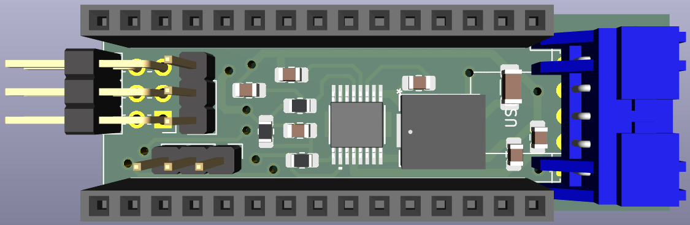
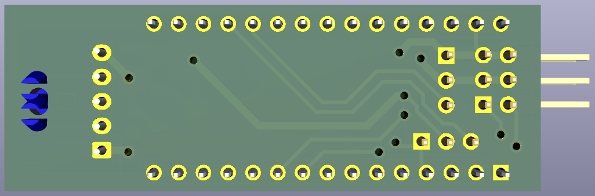

# Conception du PCB des droppers - Sous-marin autonome (ASUQTR)

**Réalisé par Louis Lavallée**

## Contexte du projet
Ce projet fut réalisé dans le cadre du projet de fin d'étude en équipe du baccalauréat en génie électrique à l'UQTR. Le projet d'équipe était centralisé sur la poursuite du développement du sous-marin autonome du club étudiant [ASUQTR](https://oraprdnt.uqtr.uquebec.ca/portail/gscw031?owa_no_site=8035). L'objectif du club ASUQTR est de participer à la compétition internationale [Robosub](https://robosub.org/) où chaque équipe doit concevoir un sous-marin et lui faire accomplir des tâches et missions de manière entièrement autonome.

## Objectif du projet
L'un des deux compartiments à batterie du sous-marin contient deux droppers. Ce sont des servomoteurs commandés et alimentés par un Arduino Nano. Dans certaines missions que le sous-marin doit accomplir à la compétition Robosub, il y a deux petits objets qui doivent être largués sur des cibles sous l'eau. Les droppers sont responsables du largage de ces objets. La problématique est que le Arduino Nano n'a pas une alimentation dimensionnée pour s'alimenter lui-même ainsi que les deux servomoteurs. Un convertisseur abaisseur alimenté directement sur l'une des batteries devait donc être installé pour fournir adéquatement la puissance nécessaire. Le PCB ainsi créé inclu des connecteurs pour y brancher le arduino et les servomoteurs et un convertisseur abaisseur pour alimenter le tout.

## Documentation
[Schémas du PCB](Schemas_PCB_Droppers.pdf)

**Schémas et layout du PCB réalisés sur** ***KiCad***\
**Fabrication par le département de GÉGI à l'UQTR et assemblage à la main.**

## Visuel 3D du PCB des droppers
\

## Photos du PCB une fois imprimé et assemblé
\

